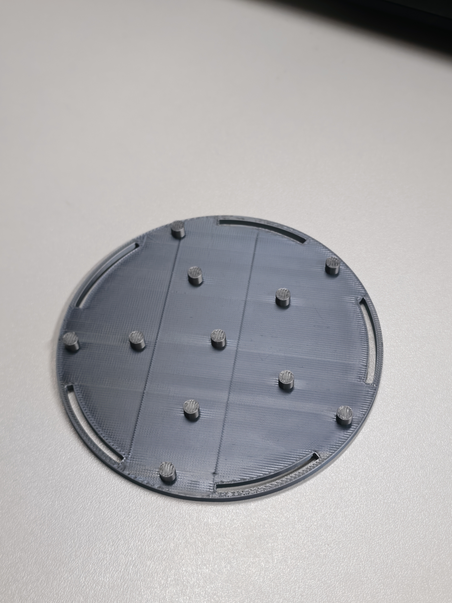
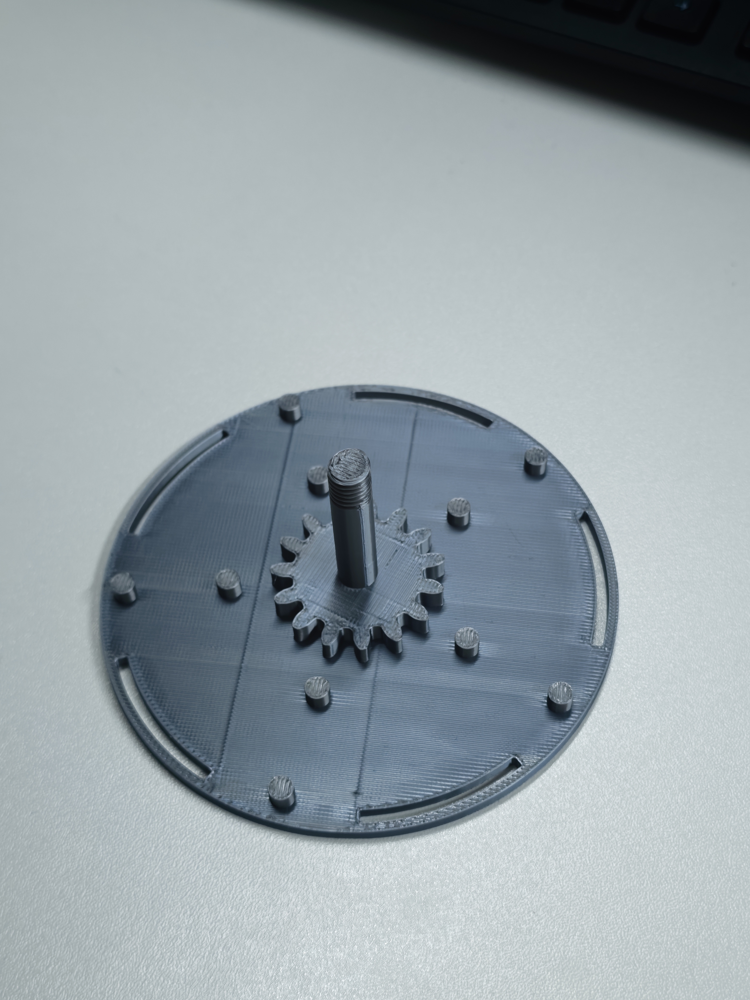
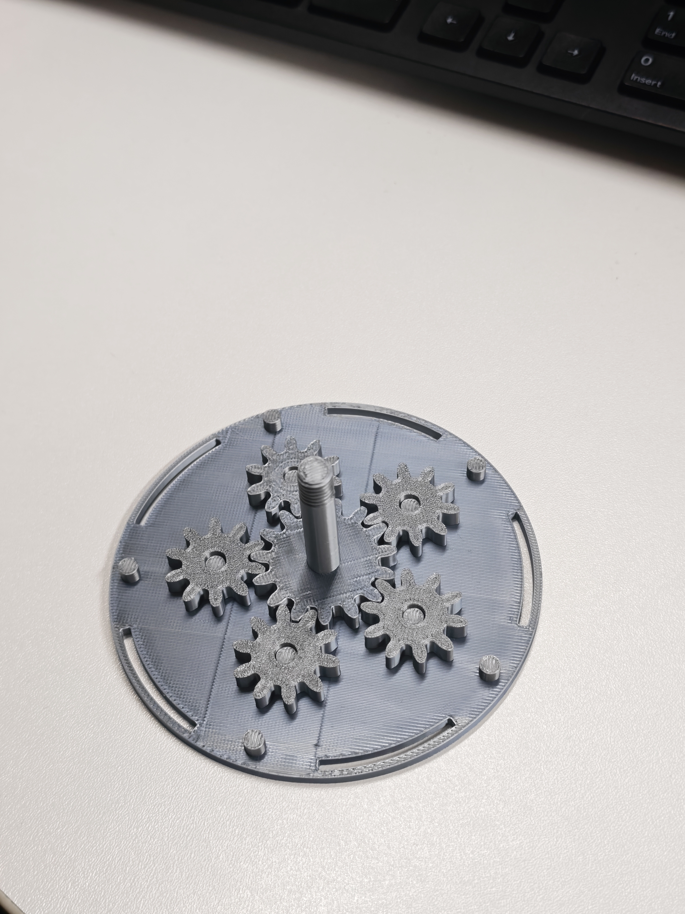
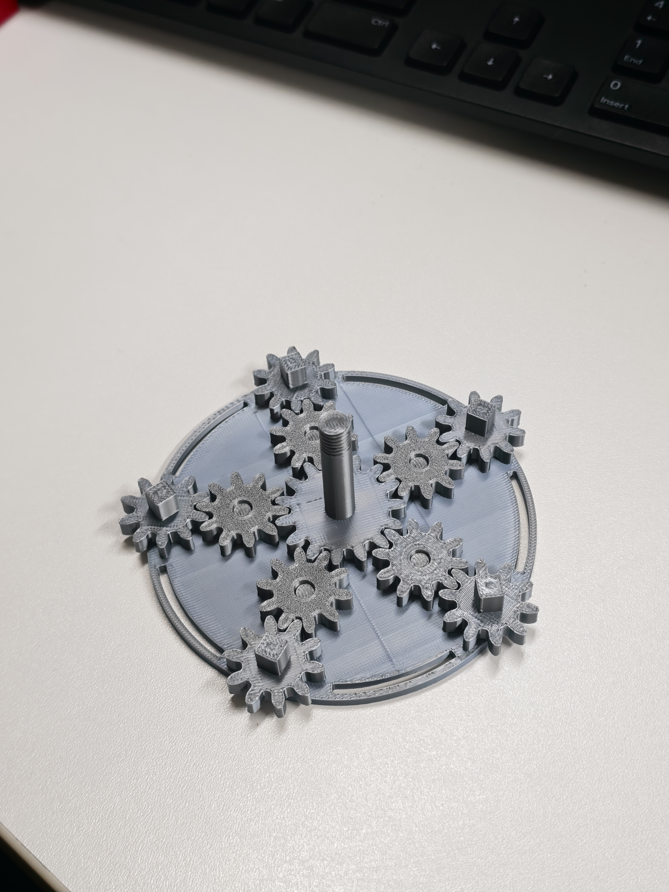
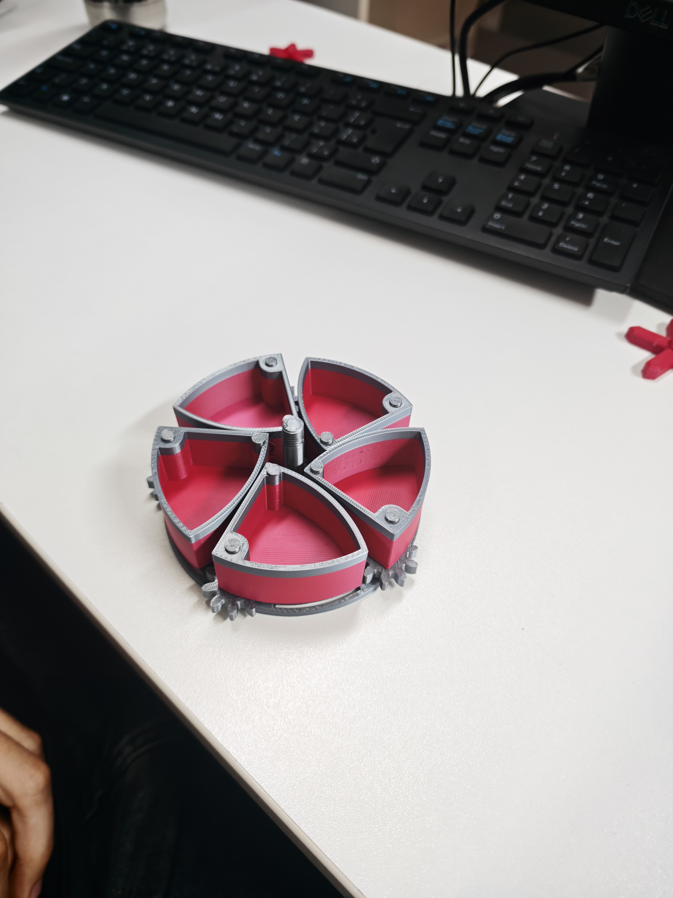
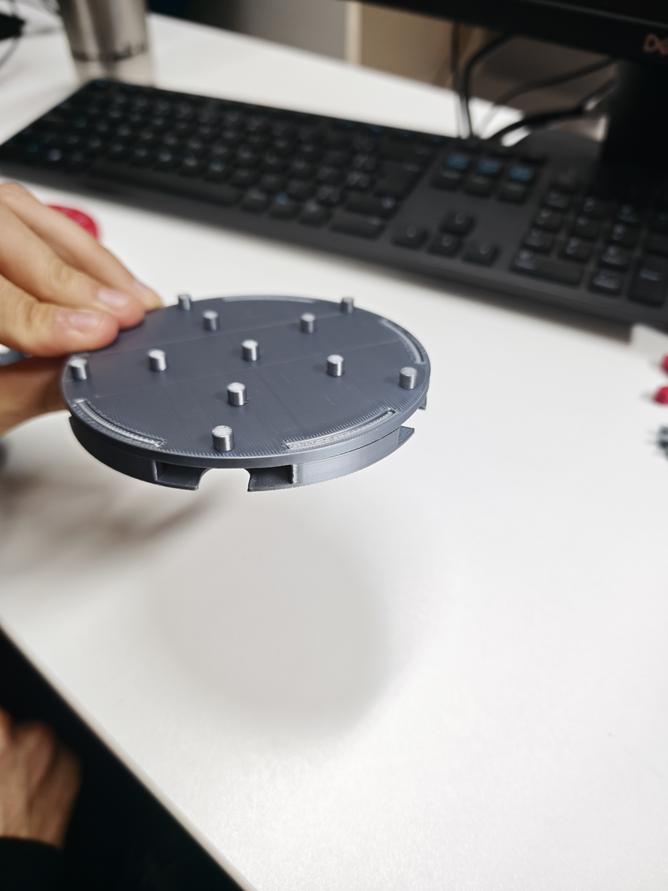
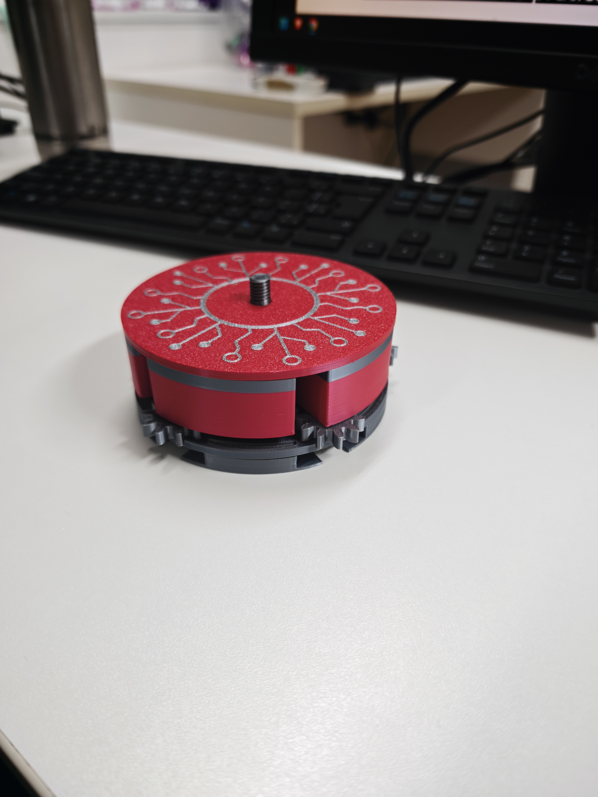
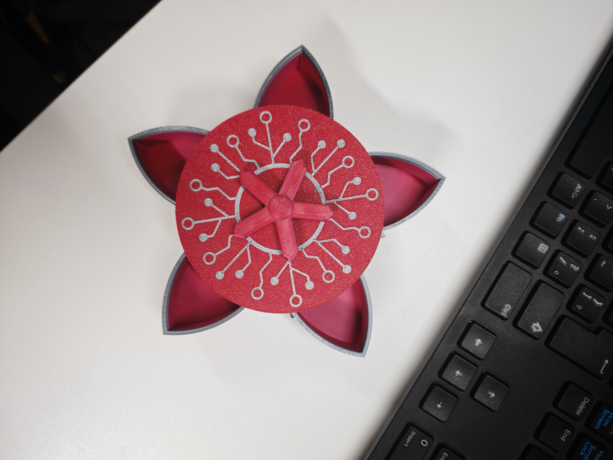
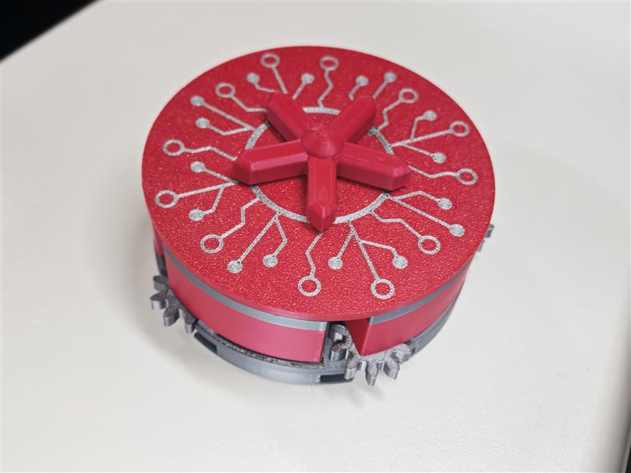

# ⚙️ Projeto de Montagem e Metrologia: Conjunto Mecânico

Este repositório contém a documentação completa para a montagem, medição e modelagem de um conjunto mecânico. O projeto foi desenvolvido como parte das atividades acadêmicas da **FIAP**, com o objetivo de compreender o 
funcionamento de sistemas de engrenagens e a aplicação de técnicas de metrologia.

## 👥 Grupo
* Breno Silva – RM99275
* Eduardo Araujo – RM99758 
* Gabriela Trevisan – RM99500 
* Gustavo Akio – RM550241
* Rafael Franck – RM550875

---

## 📋 Objetivo
Montar um sistema mecânico funcional, realizar a medição técnica das peças utilizando um paquímetro e desenvolver a modelagem 3D de um dos componentes.

---

## 📦 Inventário do Kit
Antes de iniciar a montagem, certifique-se de que todas as peças estão presentes:

* **Caixa Inferior:** 2 unidades
* **Tampa:** 1 unidade
* **Engrenagens:** 10 unidades
* **Eixos e Encaixes:** 2 unidades
* **Componentes Móveis:** 5 unidades

---

## 📏 Relatório de Metrologia

As medições abaixo foram realizadas com o auxílio de um **paquímetro**, garantindo a precisão técnica necessária para a análise do conjunto mecânico e futura modelagem 3D.

| Peça | Atributo | Medida (mm) |
| :--- | :--- | :--- |
| **Tampa** | Diâmetro | 100 mm |
| | Altura | 0,05 mm |
| **Caixa** | Diâmetro | 100 mm |
| | Altura | 0,05 mm |
| | Centro → 1ª Fileira | 2,005 mm |
| | 1ª Fileira → 2ª Fileira | 4,003 mm |
| **Eixo** | Diâmetro | 3,006 mm |
| | Altura | 4,005 mm |
| | Grossura | 0,5 mm |
| **Engrenagem com Encaixe** | Diâmetro | 2,0 mm |
| | Altura | 1,003 mm |
| | Grossura | 0,5 mm |
| **Engrenagem Comum** | Diâmetro | 2,0 mm |
| | Grossura | 0,5 mm |
| **Flor Topo** | Diâmetro | 4,008 mm |
| | Grossura | 1,0 mm |
| **Conjunto (Total)** | Largura | 3,8 mm |
| | Comprimento | 4,5 mm |
| | Grossura | 2,004 mm |

> *Nota: Os valores acima refletem as dimensões coletadas pelo grupo, fundamentais para garantir o engrenamento correto do sistema.*

---

## 🛠️ Guia de Montagem (Passo-a-Passo)

Abaixo, apresentamos o processo de montagem documentado em ordem cronológica. As imagens estão organizadas em uma grade compacta e referenciam os arquivos presentes na pasta `/imagens`.

<table border="0">
 <tr>
    <td></td>
    <td></td>
 </tr>
 <tr>
    <td></td>
    <td></td>
 </tr>
 <tr>
    <td></td>
    <td></td>
 </tr>
 <tr>
    <td></td>
    <td></td>
 </tr>
 <tr>
    <td></td>
    <td></td>
 </tr>
</table>

---

## 💻 Modelagem 3D
Para a etapa de design digital, foi selecionada a peça **tampa**.

* **Software:** [OpenSCAD]
* **Arquivo:** O arquivo fonte pode ser encontrado como `CP2Novo.scad`, neste repositório.

---

*Este projeto faz parte do currículo de Engenharia de Software da FIAP - 2026.*
